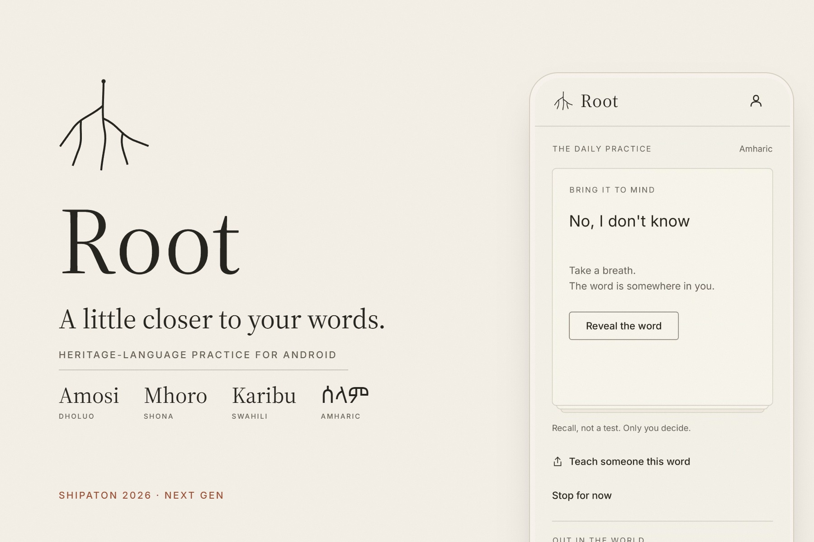
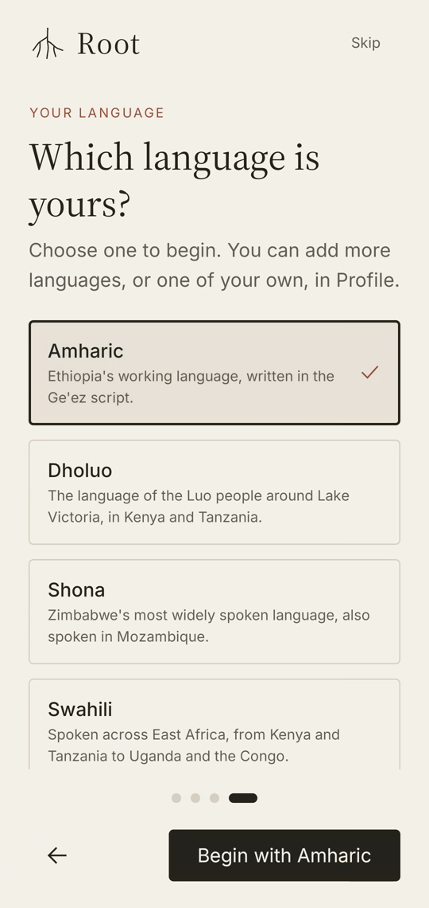
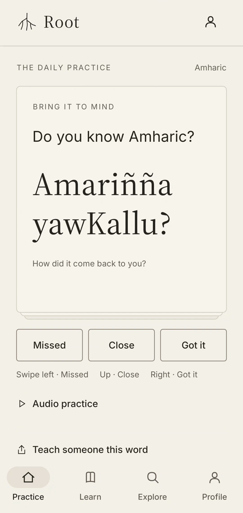
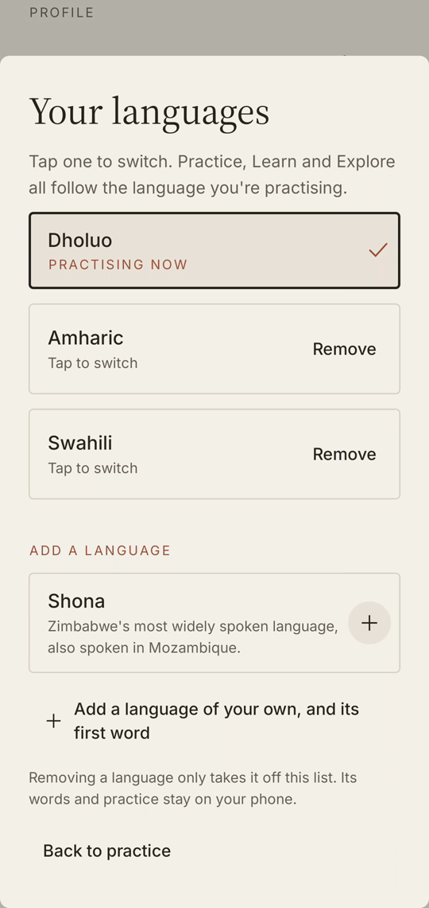
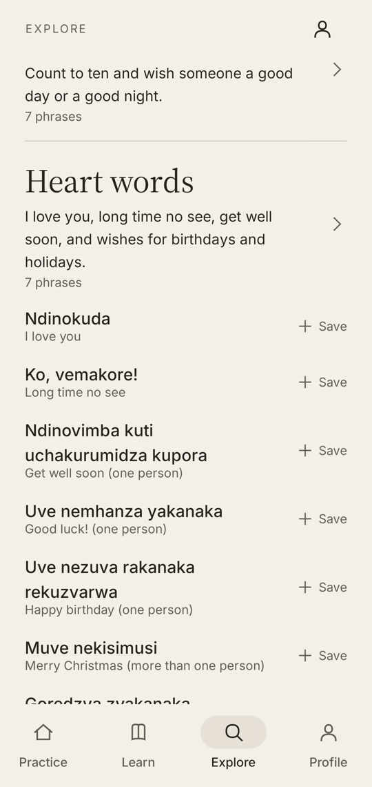
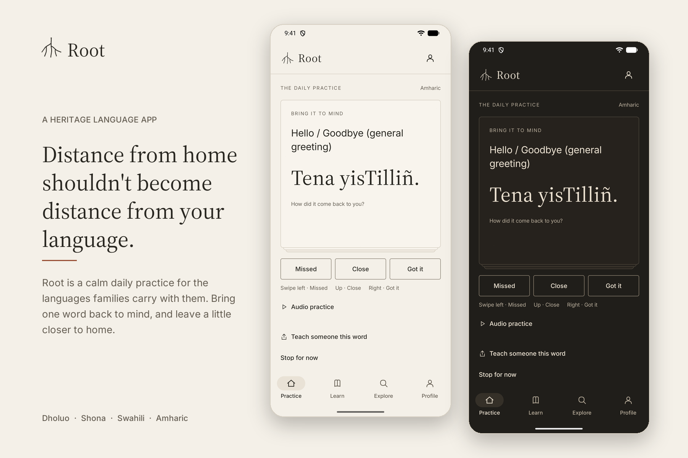
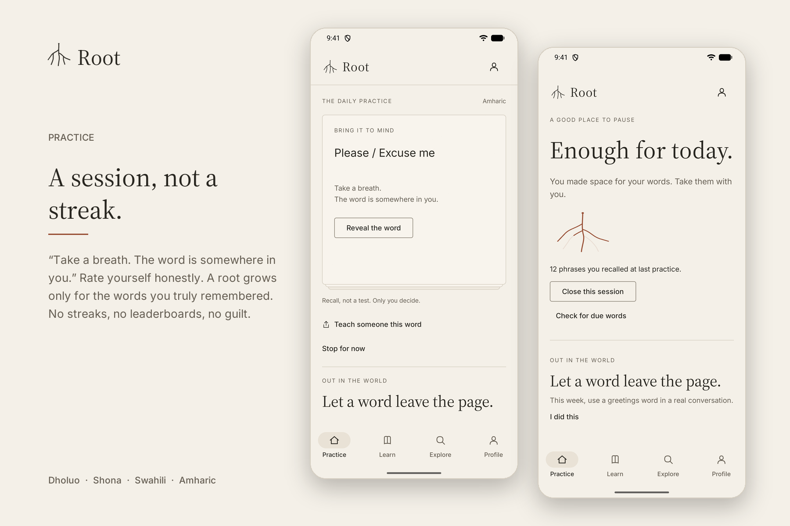
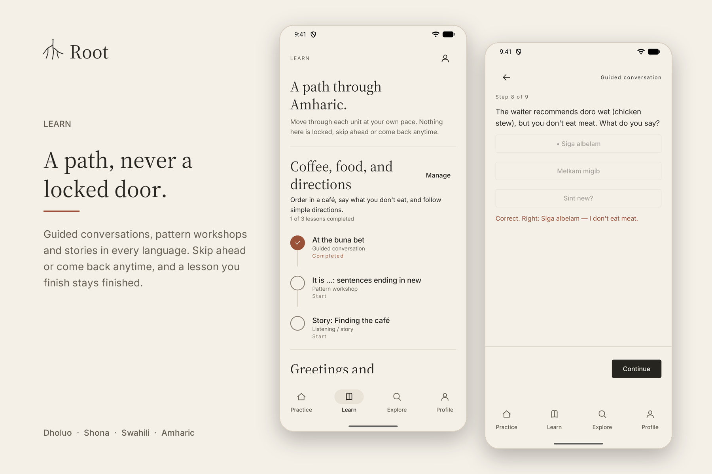
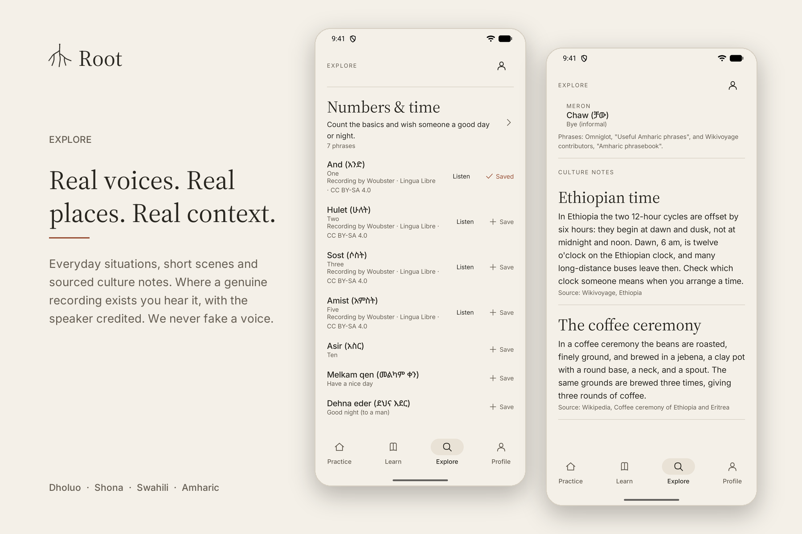

# Root

A quiet practice app for reconnecting with your heritage language. **A session, not
a destination:** open on a word, bring it to mind, rate your recall, and leave.

**Try it:** install the demo APK from the
[v0.1.0-shipaton release](https://github.com/cypher-30/Root/releases/tag/v0.1.0-shipaton)
(Android 8.0+, allow "install unknown apps", no account). It is a debug-signed demo
build: Premium runs on the RevenueCat Test Store (sandbox, no real money), or enter the
code `SHIPATON2026` on the Premium screen. Not on Google Play.



## See it

Real screens from an Android phone (OPPO CPH2159), across Amharic, Dholuo and Shona:

| First run | Practice (Amharic) | Add a language | Premium set, opened (Shona) |
|---|---|---|---|
|  |  |  |  |

| | |
|---|---|
|  |  |
|  |  |

Root is a native Android / Jetpack Compose prototype, not a collection of disconnected
mockups. The same screens work in warm-paper light mode and warm-charcoal dark mode.
Practice, contributed phrases, recordings, scheduling, and challenges live on-device.
No learner account, progress-sync backend, automated pronunciation score, streak, or leaderboard.
Optional purchases use RevenueCat and therefore need network access; that is separate
from offline practice.

## The experience

- A root-line mark, editorial wordmark, adaptive app icon, and restrained drawn-path
  launch sequence lasting 3.2 seconds, with brief seed and finished-mark pauses.
- Four always-visible tabs — **Practice, Learn, Explore, Profile** — replace a single
  screen plus an overflow menu, following Jakob's Law: navigation looks like the
  bottom tab bars learners already know.
- Practice opens directly into a small recall deck. Reveal surfaces the word through
  fade, upward drift, and soft-to-sharp focus.
- **Missed / Close / Got it** buttons or left / up / right swipes. Missed cards return
  once within a session; repeated misses never trap you in an endless deck.
- Roots grow only for distinct phrases rated **Got it**. The completion state invites
  a pause instead of awarding a score.
- **Learn** shows each installed language's lesson path (Duolingo-style, never hard
  -locked): units in sequence, each a connected path of lesson nodes with clear
  Start / Continue / Completed status. A finished lesson stays Completed; opening it
  shows its summary, and only **Review again** starts a new attempt. **Manage** on a
  unit only removes it (your completion is kept if you add it back). A **Listen ·
  Reels** shortcut appears only for units that ship real recordings.
- **Explore** is for browsing rather than following a path, in three sections:
  **Situations** (every phrase set with its phrases, a Save toggle, and Practice this
  set), **Stories & culture** (short scenes told with starter phrases, plus sourced
  culture notes), and **My notebook** (saved phrases, your own words, add a word,
  open drafts). Search is on-device and scoped to the open section.
- **Profile** (also reachable from a header icon on Practice/Learn/Explore) holds
  practice progress, appearance, sound, sharing, and the app's only language picker:
  **your languages** (picked at the end of onboarding) and **Add a language**.
- A weekly conversation nudge, reference-audio playback, local voice recording and
  comparison, an image sharing card, and a home-screen widget.
- Original interaction sounds and a "Root growth" startup sound scored to the
  launch animation, on by default at 100 % in-app volume and quiet in
  silent/vibrate, Do Not Disturb, calls and during voice audio. **Profile → Sound**
  holds the settings; **Sound → Sound Lab** previews every sound and replays the
  opening with sound. See [Sound](docs/DESIGN.md#sound).

See [the design system and motion specification](docs/DESIGN.md) and
[the development and onboarding guide](docs/DEVELOPMENT.md).

## Run

Requirements: Android Studio or Android SDK 36, a JDK 17+ to launch the Gradle
wrapper, and an Android device/emulator running API 26+. The Gradle daemon itself is
pinned to JDK 25 in `gradle/gradle-daemon-jvm.properties` and is provisioned
automatically if missing; app bytecode still targets Java 17.

Current production readiness and remaining launch gates:
[`docs/FRONTEND_TODO.md`](docs/FRONTEND_TODO.md).

```powershell
.\gradlew.bat :app:assembleDebug
.\gradlew.bat :app:installDebug
```

Output: `app\build\outputs\apk\debug\app-debug.apk`.

No API key is needed to open the prototype, practice, contribute, record, share, or
use the widget. Open the **Profile** tab (or its header shortcut) → **Paper & ink** to
choose System, Light, or Dark.

### Optional Test Store purchases

The old SDK pin could not support RevenueCat Test Store. Root now uses **9.9.0**, the
[documented minimum Android version](https://www.revenuecat.com/docs/test-and-launch/sandbox/test-store).

1. In your RevenueCat project, create a Test Store, the five one-time products and
   entitlements listed in [docs/PREMIUM.md](docs/PREMIUM.md) (`root_premium_all` →
   **`premium`**, `root_premium_<key>` → `premium_<key>`), and add them to the
   current offering.
2. Put its public SDK key in your **user-level**, untracked Gradle properties:

   ```properties
   ROOT_REVENUECAT_API_KEY=test_your_key_here
   ```

3. Build a debug APK. The paywall uses the configured products' localized prices,
   purchase result, and entitlements. Restore is available. Premium is a one-time
   unlock for one language (`root_premium_<key>`, entitlement `premium_<key>`) or for
   every language (`root_premium_all`, entitlement `premium`); subscription packages
   are not shown. The paywall offers only the current language's plan and *All
   languages*, even though the offering holds all five. A language's plan is offered
   only when it has premium sets. Until the store returns a plan, it shows planned
   prices for the phone's SIM/network country (`PremiumOffer.plannedPrices`: US$1.99
   / US$3.99 in Kenya, Zimbabwe and Ethiopia, otherwise US$4.99 / US$9.99), labelled
   as planned. The five Test Store products to create are listed in
   [docs/PREMIUM.md](docs/PREMIUM.md).

**Showcase code:** enter **SHIPATON2026** under *Have a code?* on the Premium screen
to open every premium set on that device without a purchase (for judges and demos;
*Remove code* locks them again). It is local only and is not a RevenueCat transaction.

Release builds read a separate `ROOT_REVENUECAT_RELEASE_API_KEY`, so a debug Test
Store key is never packaged. `verifyReleaseConfiguration` runs before every release
build and rejects Test Store or placeholder keys. For a store build, add
`-ProotPublicRelease=true`. It then also requires the release key,
`ROOT_PRIVACY_POLICY_URL`, `ROOT_TERMS_URL`, and `ROOT_SUPPORT_URL` (HTTPS), and
refuses unreviewed sample content (`ROOT_RELEASE_SAMPLE_CONTENT` must stay false).

Never put secret API keys in the source tree. Never distribute a release using a
Test Store key. Without a configured SDK, the paywall remains a labeled content
preview; it does not pretend a purchase succeeded. Practice never depends on billing
initialization or a successful network response.

## Content: an important boundary

Four languages are available now: **Dholuo, Shona, Swahili, and Amharic**. Each has
five or six topic sets with 39–40 source-checked starter phrases in total, two Learn
units of three lessons each, and two stories and two culture notes in Explore. Choose
the language in **Profile → Language**; that is the only picker, and it switches
Practice, Learn, and Explore together. Your active language and existing recall
history are preserved when the app updates.

Every starter phrase was checked against a public reference (Wikivoyage, Omniglot,
Wiktionary, or the public-domain FSI Amharic course). Source-checking is **not
native-speaker approval**; dialect, register, and respectful usage still need review.
Sources and licenses ship offline in `app\src\main\assets\content_sources.txt`.
Every starter set is free. Premium adds two more sets per language from the same
sources (Dholuo: Body & health, Days of the week; Shona, Swahili and Amharic: Heart
words, Keep talking), shown locked in Explore until that language is unlocked. See
[docs/PREMIUM.md](docs/PREMIUM.md) for what it includes and its price.

Six starter phrases play real recordings: Swahili "Karibu" and Amharic የት (where),
አንድ, ሁለት, ሶስት and አምስት (one, two, three, five). They are unmodified Lingua Libre
clips from Wikimedia Commons (CC BY-SA 4.0), bundled in `app\src\main\assets\audio\seed\`
and matched in `SeedAudio.kt` only where the recorded word is exactly the answer.
The speaker and licence are shown under **Play reference**. Lingua Libre speakers
are volunteers, so these clips aren't described as native-reviewed. Dholuo and Shona
have no matching recordings, and no lesson has audio yet.
Root does not fabricate a voice or
substitute text-to-speech. Missing audio is handled explicitly: listening steps say
a real recording is needed, and a lesson whose required step needs audio is labelled
“needs a real recording to finish” instead of being marked complete.
Use **Add a word of your own** to save a phrase and an optional reference recording;
get the speaker's permission first. Learner comparison recordings stay separate.
User-authored content is free, including a language you add yourself.

Before content launch: curate licensed phrases, obtain native-speaker review, record
or license pronunciation audio, and have the premium sets reviewed too. Do not sell
empty catalog entries. The original Kencorpus curation project remains a separate content
deliverable, not something the visual prototype silently claims to have completed.

### Teaching and downloadable content

The next backend foundation adds versioned content contracts, a Room-backed lesson
runner, and a Python content toolchain. Guided conversations, listening/comprehension,
and pattern workshops use the same activity model. Teaching events stay separate
from recall ratings: completing a lesson never automatically records **Got it** or
claims speaking proficiency.

Debug builds bundle eight Learn units: the Shona greetings unit plus seven showcase
units (Shona and Amharic meeting people, Swahili meeting people and market, Dholuo
family and market, Amharic café), generated by
`tools\content\scripts\build_showcase_units.py`. Their lines come only from the
source-checked starter phrases; native-speaker review and authentic audio are still
outstanding. Listening with no recording stays explicitly unavailable, not completed
through a transcript-only substitute. These packs are marked unpublished in their
manifests, excluded from release assets, and made unavailable if a release replaces a
debug install.

The content toolchain supports KenCorpus, FLEURS, Common Voice, and Tatoeba source
formats. An importer is not an approved curriculum: text, translations, explanations,
audio rights, attribution, and revision-specific review must pass publication gates.
See [the content runbook](docs/CONTENT.md) and
[teaching contracts](docs/TEACHING_CONTRACTS.md).

Optional public downloads use a configured HTTPS catalog. Put the **public URL** in
your user-level Gradle properties, never a service-role key:

```properties
ROOT_CONTENT_CATALOG_URL=https://YOUR_PROJECT.supabase.co/storage/v1/object/public/root-content/catalog.json
```

Without this setting, bundled/local practice remains available and refreshing the
remote catalog reports that downloads are not configured. No Supabase project has
been provisioned by this change. Hosting verification and the reviewed Shona release
remain external gates; configuring a URL alone does not satisfy them.

Downloads are explicit, bounded, hash-verified, and activated only after their
files and database records are ready. Failed updates preserve the installed version.
Lesson runs pin their content revision and resume after leaving or process death.
Removing a downloaded pack preserves learning/recall history and personal recordings.
Public packs must be free; protected paid delivery and account sync are not implemented.

## Sharing is not a referral system

**Teach someone one word** exports a PNG with the target phrase, its meaning, and the
Root mark. Android's system share sheet receives a temporary, read-only content URI.

Sharing unlocks nothing; every starter set is already free, and the screen says so.
Root cannot verify delivery, an install, or a friend's activity; it does not claim
otherwise. It keeps a local record that the share sheet was opened, which a future
thank-you could use; nothing advertises one.

## Local data and privacy

- Room holds language packs, phrases, attempts, weekly challenges, immutable installed
  content revisions, installation jobs, and separate lesson runs/events.
- Fixed next-review intervals: **Missed: four hours; Close: one day; Got it: four days**.
  Same-session retry is a separate, bounded queue rule.
- Seeding is idempotent and preserves existing phrase IDs and learner history.
- Active language, appearance, sound, and the has-shared record are device-local preferences.
- Microphone permission is requested only for recording. Audio lives in app-internal
  storage; sharing a phrase card does not share your recordings.
- Downloaded phrase exports include their required credits in the PNG itself.
  New development teaching content is not approved for public image sharing.
- Android backup is disabled. Uninstalling the app removes its local practice data.
- RevenueCat, when configured, has its own network and anonymous purchase identity;
  “no account” is not a claim that configured billing sends no data.

## Verification

```powershell
.\gradlew.bat :app:testDebugUnitTest
# Interaction sounds must match their deterministic recipes and loudness limits:
python tools\audio\generate_root_sounds.py --check
# With a running emulator / attached device; choose its serial explicitly:
.\tools\android\Invoke-ValidationTests.ps1 -Serial "emulator-5554"
```

The device runner installs a separate, keyless **Root Validation** app
(`com.root.app.validation`), verifies APK/runner identities, and leaves the normal
Root installation untouched. Its navigation fixtures reset validation-only data.
Use `-Classes` for targeted instrumentation and `-SkipBuild` only when reusing
current validation APKs; see the development guide for details and report paths.

Unit coverage includes scheduler rules. Device tests cover the durable practice
session engine (resume, paging, idempotent rating, one-retry rule, stop/close), the
Room schema migration, reveal/rating accessibility, both themes, session closure,
and connected navigation. Visual and real-purchase checks are described in
[DESIGN.md](docs/DESIGN.md#verification).

## Code map

```text
app\src\main\kotlin\com\root\app\
  MainActivity.kt       — connected navigation, theme and language sheets
  RootViewModel.kt      — thin UI adapter over PracticeRepository; only a session id is saved-state
  RootApplication.kt    — optional guarded billing initialization
  data\                 — Room, repository, seed content, scheduling, preferences
  practice\             — durable, Room-backed practice session engine (paging, rating, resume, stop/close)
  content\              — versioned pack contracts, validation, HTTPS delivery and atomic activation
  learning\             — durable teaching commands and separate learning evidence
  billing\              — shared premium entitlement state
  sharing\              — phrase-card image generation / sharing
  audio\                — local playback and recording; interaction sounds (on by default) and quiet policy
  widget\               — Glance due-phrase widget
  ui\                   — practice, completion, packs, paywall, invite, contribution
    theme\              — color, serif/grotesque type, tight shapes, paper grain
    root\               — shared ordered vector branches
    brand\              — icon-scale mark and wordmark lockup
    launch\             — ink seed → roots → wordmark
    motion\             — restrained springs, easing, haptic vocabulary
```

`tools\content\` contains the Python ingestion/build/publish CLI;
`tools\audio\generate_root_sounds.py` regenerates the original interaction sounds
in `app\src\main\res\raw\root_sound_*.wav` (run it with no arguments to rewrite them,
or `--check` to verify them);
`content\` contains shared schemas, source metadata, fixtures, and editorial inputs.

Source Serif 4 and Inter are bundled under the SIL Open Font License. Their licenses
ship in `app\src\main\assets\licenses`. App code: MIT — see [LICENSE](LICENSE).

For the full architecture walkthrough, data flow, and extension guide, see
[docs/DEVELOPMENT.md](docs/DEVELOPMENT.md).
